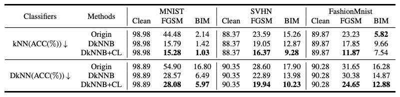
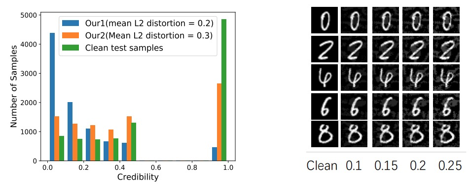

# AdvKnn: Adversarial Attacks On K-Nearest Neighbor Classifiers With Approximate Gradients
This repository contains a PyTorch implementation of the algorithm presented in the paper AdvKnn: Adversarial Attacks On K-Nearest Neighbor Classifiers With Approximate Gradients. [https://arxiv.org/abs/1911.06591](https://arxiv.org/abs/1911.06591)

## AdvKnn

Deep neural networks have been shown to be vulnerable to adversarial examples—maliciously crafted examples that can trigger the target model to misbehave by adding imperceptible perturbations. Existing attack methods for k-nearest neighbor (kNN) based algorithms either require large perturbations or are not applicable for large k. To handle this problem, this paper proposes a new method called AdvKNN for evaluating the adversarial robustness of kNNbased models. Firstly, we propose a deep kNN block to approximate the output of kNN methods, which is differentiable thus can provide gradients for attacks to cross the decision boundary with small distortions. Second, a new consistency learning for distribution instead of classification is proposed for the effectiveness in distribution based methods. Extensive experimental results indicate that the proposed method significantly outperforms state of the art in terms of attack success rate and the added perturbations.


## Prerequisites
The following packages are required to run the scripts:
- python3.6.5
- [PyTorch-1.0 and torchvision=0.2.2](https://pytorch.org)
- Package [Advertorch](https://github.com/BorealisAI/advertorch)

## Result



## Usage

### Pre-Trained Models
To get a trained model, please run the following command:
```bash
python train_mnist.py
```
### Testing
First, you need to extract features for knn by define extract=True (otherwise, it will be really time-consuming). Once it's done, please run the following command to attack.
```bash
python attack.py
```

We have provided the pretrained knn model for mnist dataset in this [url](https://drive.google.com/open?id=1LwUIr8_h6nzhtViwB1lkkH8McE_x8KWv).

## References
[Deep k-Nearest Neighbors: Towards Confident, Interpretable and Robust Deep Learning](https://arxiv.org/abs/1803.04765)

[On the Robustness of Deep K-Nearest Neighbors](https://arxiv.org/abs/1903.08333)

## Citation
```
@article{li2019advknn,
  title={AdvKnn: Adversarial Attacks On K-Nearest Neighbor Classifiers With Approximate Gradients},
  author={Li, Xiaodan and Chen, Yuefeng and He, Yuan and Xue, Hui},
  journal={arXiv preprint arXiv:1911.06591},
  year={2019}
}
```
## Contact
For questions please contact Xiaodan Li at fiona.lxd@alibaba-inc.com.

## Acknowledgements
This code is built on [dknn_attack](https://github.com/chawins/dknn_attack) (PyTorch). We thank the authors for sharing their codes.
